# CHAKRAVYUH - Complete Tech Stack & Workflow

## System Overview

**Project Name:** CHAKRAVYUH Multimodal RAG  
**Hackathon:** CHAKRAVYUH 1.0 - GITACVPS004

```mermaid
graph TB
    subgraph "Data Sources"
        PDF[📄 PDF]
        IMG[🖼️ Images]
        AUD[🎵 Audio]
        VID[🎬 Video]
    end
    
    subgraph "Ingestion Pipeline"
        DP[Document Parser]
        IE[Image Encoder]
        AT[Audio Transcriber]
        VP[Video Processor]
    end
    
    subgraph "Unified Storage"
        LDB[(LanceDB)]
        TS[Timestamp Index]
        SM[Source Metadata]
    end
    
    subgraph "RAG Engine"
        IA[Intent Analyzer]
        RET[Cross-Modal Retriever]
        CD[Conflict Detector]
        UC[Uncertainty Calculator]
        HG[Hallucination Guard]
    end
    
    subgraph "Generation"
        LLM[Multi-LLM Router]
        CG[Citation Generator]
    end
    
    subgraph "Output"
        API[REST API]
        UI[Evidence Explorer]
        CVG[Conflict Graph]
        OBS[Obsidian Export]
    end
    
    PDF --> DP --> LDB
    IMG --> IE --> LDB
    AUD --> AT --> LDB
    VID --> VP --> LDB
    VP --> TS
    
    LDB --> RET
    RET --> CD --> UC --> HG --> LLM
    LLM --> CG --> API
    API --> UI
    CD --> CVG
    CG --> OBS
```



---

## Tech Stack Summary

| Layer | Component | Technology | Why |
|-------|-----------|------------|-----|
| **Vector DB** | Unified Storage | **LanceDB** | Native multimodal, CLIP support, local-first, fast |
| **Embeddings** | Text | `sentence-transformers/all-MiniLM-L6-v2` | Fast, good quality |
| **Embeddings** | Multimodal | `openai/clip-vit-base-patch32` | Image-text alignment |
| **Audio** | Transcription | **Whisper** (local) | Word-level timestamps |
| **Video** | Frame Extraction | **FFmpeg + OpenCV** | Keyframe extraction |
| **Video** | Frame Analysis | **CLIP** | Visual embeddings |
| **OCR** | Text in Images | **EasyOCR** | Multilingual, accurate |
| **PDF** | Parsing | **PyMuPDF + pdfplumber** | Tables + text + images |
| **LLM (Local)** | Primary | **Ollama (Llama3.2/Mistral)** | No cloud dependency |
| **LLM (Cloud)** | Fallback | **OpenRouter** (multi-model) | Failover + variety |
| **NLI** | Conflict Detection | `cross-encoder/nli-deberta-v3-base` | High accuracy |
| **Backend** | API | **FastAPI** | Async, fast, typed |
| **Frontend** | UI | **React + TypeScript** | Interactive components |
| **Graphs** | Visualization | **D3.js / Cytoscape.js** | Conflict graph |
| **Export** | Obsidian | **Markdown + YAML frontmatter** | Linked notes |

---

## Detailed Component Breakdown

### 1. Vector Database: LanceDB

```python
# Why LanceDB?
# ✅ Native multimodal support (text + images in same table)
# ✅ Local-first (no server needed)
# ✅ Scales to billions of vectors
# ✅ Built-in CLIP integration
# ✅ Apache Arrow format (fast)
```

**Schema Design:**
```python
import lancedb
from lancedb.pydantic import LanceModel, Vector

class EvidenceChunk(LanceModel):
    chunk_id: str                    # Unique identifier
    source_file: str                 # Original file path
    source_type: str                 # pdf | image | audio | video
    modality: str                    # text | image | audio_transcript | video_frame
    
    # Content
    text_content: str | None         # Extracted/transcribed text
    image_path: str | None           # Path to image/frame
    
    # Embeddings (768-dim for CLIP)
    text_embedding: Vector(384) | None   # Text embedding
    image_embedding: Vector(512) | None  # CLIP image embedding
    
    # Localization
    page_number: int | None          # For PDFs
    timestamp_start: float | None    # For audio/video (seconds)
    timestamp_end: float | None
    bbox: list[float] | None         # [x1, y1, x2, y2] for images
    
    # Metadata
    confidence: float = 1.0
    created_at: str
```

---

### 2. Embedding Models

| Content Type | Model | Dimension | Speed |
|--------------|-------|-----------|-------|
| Text | `all-MiniLM-L6-v2` | 384 | ⚡ Fast |
| Text (alt) | `all-mpnet-base-v2` | 768 | 🔄 Better quality |
| Images | `clip-vit-base-patch32` | 512 | ⚡ Fast |
| Cross-modal | `CLIP` | 512 | Unified space |

```python
from sentence_transformers import SentenceTransformer
from transformers import CLIPProcessor, CLIPModel

# Text embeddings
text_model = SentenceTransformer('all-MiniLM-L6-v2')

# Image embeddings (CLIP)
clip_model = CLIPModel.from_pretrained("openai/clip-vit-base-patch32")
clip_processor = CLIPProcessor.from_pretrained("openai/clip-vit-base-patch32")
```

---

### 3. Document Parsers

#### PDF Parser
```python
# Primary: PyMuPDF (fitz) - fast, extracts images
# Secondary: pdfplumber - better table extraction

import fitz  # PyMuPDF
import pdfplumber

def parse_pdf(path: str) -> list[EvidenceChunk]:
    chunks = []
    
    # Extract text and images with PyMuPDF
    doc = fitz.open(path)
    for page_num, page in enumerate(doc):
        # Text
        text = page.get_text()
        chunks.append(create_text_chunk(text, page_num))
        
        # Images
        for img in page.get_images():
            img_data = extract_image(doc, img)
            chunks.append(create_image_chunk(img_data, page_num))
    
    # Extract tables with pdfplumber
    with pdfplumber.open(path) as pdf:
        for page_num, page in enumerate(pdf.pages):
            tables = page.extract_tables()
            for table in tables:
                chunks.append(create_table_chunk(table, page_num))
    
    return chunks
```

#### Image Parser
```python
from PIL import Image
import easyocr

# OCR for text in images
ocr_reader = easyocr.Reader(['en'])

def parse_image(path: str) -> list[EvidenceChunk]:
    chunks = []
    
    # CLIP embedding for visual content
    image = Image.open(path)
    clip_embedding = get_clip_embedding(image)
    chunks.append(create_image_chunk(path, clip_embedding))
    
    # OCR for text in image
    ocr_results = ocr_reader.readtext(path)
    if ocr_results:
        text = " ".join([r[1] for r in ocr_results])
        chunks.append(create_text_chunk(text, source=path))
    
    return chunks
```

---

### 4. Audio/Video Processing

#### Audio Transcription (Whisper)
```python
import whisper

# Load model once (medium is good balance)
whisper_model = whisper.load_model("medium")

def transcribe_audio(path: str) -> list[EvidenceChunk]:
    result = whisper_model.transcribe(
        path,
        word_timestamps=True,
        verbose=False
    )
    
    chunks = []
    for segment in result["segments"]:
        chunks.append(EvidenceChunk(
            text_content=segment["text"],
            timestamp_start=segment["start"],
            timestamp_end=segment["end"],
            source_type="audio",
            modality="audio_transcript"
        ))
    
    return chunks
```

#### Video Processor
```python
import cv2
from scenedetect import detect, ContentDetector

def process_video(path: str) -> list[EvidenceChunk]:
    chunks = []
    
    # 1. Extract audio track → transcribe
    audio_path = extract_audio(path)
    transcript_chunks = transcribe_audio(audio_path)
    chunks.extend(transcript_chunks)
    
    # 2. Detect scene changes for keyframes
    scenes = detect(path, ContentDetector())
    
    # 3. Extract keyframes at scene boundaries
    cap = cv2.VideoCapture(path)
    fps = cap.get(cv2.CAP_PROP_FPS)
    
    for scene in scenes:
        frame_num = int(scene[0].get_seconds() * fps)
        cap.set(cv2.CAP_PROP_POS_FRAMES, frame_num)
        ret, frame = cap.read()
        
        if ret:
            # Save frame
            frame_path = save_frame(frame, path, frame_num)
            
            # Get CLIP embedding
            clip_emb = get_clip_embedding(frame)
            
            # OCR for text in frame
            ocr_text = ocr_reader.readtext(frame)
            
            chunks.append(EvidenceChunk(
                image_path=frame_path,
                image_embedding=clip_emb,
                text_content=ocr_text,
                timestamp_start=scene[0].get_seconds(),
                source_type="video",
                modality="video_frame"
            ))
    
    cap.release()
    return chunks
```

---

### 5. Multi-LLM Router

> [!IMPORTANT]
> **Hackathon Constraint:** Cannot rely solely on a single cloud-based LLM.

```python
from enum import Enum
import httpx

class LLMProvider(Enum):
    OLLAMA = "ollama"           # Local (primary)
    OPENROUTER = "openrouter"   # Cloud fallback (multi-model)

class MultiLLMRouter:
    def __init__(self):
        self.ollama_url = "http://localhost:11434"
        self.openrouter_key = os.getenv("OPENROUTER_API_KEY")
        
        # Model preferences
        self.local_models = ["llama3.2", "mistral", "phi3"]
        self.cloud_models = [
            "anthropic/claude-3-haiku",
            "google/gemini-flash-1.5",
            "mistralai/mistral-7b-instruct"
        ]
    
    async def generate(self, prompt: str, context: str) -> str:
        # Try local first
        try:
            return await self._ollama_generate(prompt, context)
        except Exception as e:
            logger.warning(f"Ollama failed: {e}, falling back to cloud")
        
        # Fallback to cloud
        return await self._openrouter_generate(prompt, context)
    
    async def _ollama_generate(self, prompt: str, context: str) -> str:
        async with httpx.AsyncClient(timeout=120) as client:
            response = await client.post(
                f"{self.ollama_url}/api/chat",
                json={
                    "model": self.local_models[0],
                    "messages": [
                        {"role": "system", "content": SYSTEM_PROMPT},
                        {"role": "user", "content": f"Context:\n{context}\n\nQuestion: {prompt}"}
                    ],
                    "stream": False
                }
            )
            return response.json()["message"]["content"]
```

---

### 6. Conflict Detection (NLI)

```python
from transformers import AutoModelForSequenceClassification, AutoTokenizer
import torch

class ConflictDetector:
    def __init__(self):
        model_name = "cross-encoder/nli-deberta-v3-base"
        self.tokenizer = AutoTokenizer.from_pretrained(model_name)
        self.model = AutoModelForSequenceClassification.from_pretrained(model_name)
        self.labels = ["contradiction", "entailment", "neutral"]
    
    def detect_conflicts(self, evidences: list[EvidenceChunk]) -> list[dict]:
        conflicts = []
        
        for i, e1 in enumerate(evidences):
            for e2 in evidences[i+1:]:
                if not e1.text_content or not e2.text_content:
                    continue
                
                # Run NLI
                inputs = self.tokenizer(
                    e1.text_content, e2.text_content,
                    return_tensors="pt", truncation=True
                )
                outputs = self.model(**inputs)
                probs = torch.softmax(outputs.logits, dim=1)[0]
                
                # Check for contradiction
                if probs[0] > 0.7:  # contradiction threshold
                    conflicts.append({
                        "source_a": e1.chunk_id,
                        "source_b": e2.chunk_id,
                        "type": "contradiction",
                        "confidence": float(probs[0]),
                        "text_a": e1.text_content[:200],
                        "text_b": e2.text_content[:200]
                    })
        
        return conflicts
```

---

### 7. Uncertainty & Hallucination Guard

```python
class UncertaintyCalculator:
    def __init__(self, confidence_threshold: float = 0.6):
        self.threshold = confidence_threshold
    
    def calculate(self, evidence_chunks: list[EvidenceChunk]) -> dict:
        if not evidence_chunks:
            return {
                "should_answer": False,
                "reason": "No evidence found",
                "confidence": 0.0
            }
        
        # Aggregate confidence from retrieval scores
        scores = [e.confidence for e in evidence_chunks]
        avg_confidence = sum(scores) / len(scores)
        max_confidence = max(scores)
        
        # Check modality coverage
        modalities = set(e.modality for e in evidence_chunks)
        
        return {
            "should_answer": max_confidence >= self.threshold,
            "confidence": avg_confidence,
            "max_confidence": max_confidence,
            "modalities_found": list(modalities),
            "evidence_count": len(evidence_chunks),
            "reason": self._get_reason(avg_confidence, modalities)
        }
    
    def _get_reason(self, conf: float, modalities: set) -> str:
        if conf < 0.3:
            return "Insufficient evidence - refusing to answer"
        elif conf < 0.6:
            return "Low confidence - answer may be incomplete"
        else:
            return "Adequate evidence found"


class HallucinationGuard:
    def __init__(self, uncertainty_calc: UncertaintyCalculator):
        self.uncertainty = uncertainty_calc
    
    def check(self, query: str, evidence: list[EvidenceChunk]) -> dict:
        result = self.uncertainty.calculate(evidence)
        
        if not result["should_answer"]:
            return {
                "action": "REFUSE",
                "message": f"I cannot answer this question. {result['reason']}",
                "missing_info": self._identify_gaps(query, evidence)
            }
        
        return {
            "action": "PROCEED",
            "confidence": result["confidence"],
            "evidence": evidence
        }
    
    def _identify_gaps(self, query: str, evidence: list) -> list[str]:
        # Identify what information is missing
        gaps = []
        if not evidence:
            gaps.append("No relevant documents found")
        # Add more gap detection logic
        return gaps
```

---

### 8. API Structure (FastAPI)

```python
from fastapi import FastAPI, UploadFile, HTTPException
from pydantic import BaseModel

app = FastAPI(title="CHAKRAVYUH Multimodal RAG")

# === Request/Response Models ===

class QueryRequest(BaseModel):
    query: str
    modalities: list[str] | None = None  # Filter by modality
    max_results: int = 5

class Citation(BaseModel):
    chunk_id: str
    source_file: str
    source_type: str
    text_snippet: str
    confidence: float
    page: int | None = None
    timestamp: float | None = None
    bbox: list[float] | None = None
    conflicts_with: list[str] = []

class QueryResponse(BaseModel):
    answer: str
    confidence: float
    citations: list[Citation]
    conflicts: list[dict]
    refused: bool = False
    refusal_reason: str | None = None
    modalities_searched: list[str]

# === Endpoints ===

@app.post("/ingest")
async def ingest_document(file: UploadFile):
    """Ingest a document into the knowledge base"""
    pass

@app.post("/query", response_model=QueryResponse)
async def query(request: QueryRequest):
    """Query the multimodal knowledge base"""
    pass

@app.get("/evidence/{chunk_id}")
async def get_evidence(chunk_id: str):
    """Get raw evidence source for click-to-source"""
    pass

@app.get("/conflicts/{query_id}")
async def get_conflict_graph(query_id: str):
    """Get conflict graph data for visualization"""
    pass

@app.post("/export/obsidian")
async def export_to_obsidian(query_id: str):
    """Export query session to Obsidian vault"""
    pass
```

---

### 9. Frontend Components

| Component | Technology | Purpose |
|-----------|------------|---------|
| Main UI | React + TypeScript | SPA framework |
| Styling | Tailwind CSS | Rapid styling |
| Chat Interface | Custom component | Query input + response |
| Evidence Panel | Accordion component | Collapsible citations |
| PDF Viewer | react-pdf | Click-to-page |
| Video Player | react-player | Timestamp jumping |
| Conflict Graph | D3.js / Cytoscape | Interactive graph |
| Confidence Bars | CSS gradients | Visual confidence |

---

### 10. Obsidian Export Structure

```
obsidian_vault/
├── _index.md                    # Dashboard
├── queries/
│   └── YYYY-MM-DD_HH-MM-SS_<slug>.md
├── evidence/
│   ├── pdf/
│   │   └── <filename>_p<page>.md
│   ├── image/
│   │   └── <filename>.md
│   ├── audio/
│   │   └── <filename>_<timestamp>.md
│   └── video/
│       └── <filename>_<timestamp>.md
├── conflicts/
│   └── conflict_<id>.md
├── daily/
│   └── YYYY-MM-DD.md
└── assets/
    ├── frames/
    └── screenshots/
```

---

## Complete Data Flow

```mermaid
sequenceDiagram
    participant U as User
    participant API as FastAPI
    participant ING as Ingestion
    participant LDB as LanceDB
    participant RET as Retriever
    participant NLI as Conflict Detector
    participant UC as Uncertainty Calc
    participant HG as Hallucination Guard
    participant LLM as Multi-LLM
    participant UI as Frontend

    U->>API: Upload document
    API->>ING: Process file
    ING->>ING: Parse (PDF/Image/Audio/Video)
    ING->>ING: Generate embeddings
    ING->>LDB: Store chunks
    API->>U: ✅ Indexed

    U->>API: Query
    API->>RET: Cross-modal search
    RET->>LDB: Vector similarity
    LDB->>RET: Top-k chunks
    RET->>NLI: Check conflicts
    NLI->>UC: Calculate confidence
    UC->>HG: Should answer?
    
    alt Refuse to answer
        HG->>API: REFUSE + reason
        API->>U: Cannot answer (+ missing info)
    else Proceed
        HG->>LLM: Generate with context
        LLM->>API: Answer + citations
        API->>U: Response
    end
    
    U->>UI: Click citation
    UI->>API: Get raw evidence
    API->>U: PDF page / Video timestamp / Image
```



---

## Python Dependencies

```txt
# requirements.txt

# Core
fastapi>=0.109.0
uvicorn>=0.27.0
pydantic>=2.5.0
python-multipart>=0.0.6

# Vector DB
lancedb>=0.4.0
pyarrow>=14.0.0

# Embeddings
sentence-transformers>=2.2.0
transformers>=4.36.0
torch>=2.1.0

# Document Processing
pymupdf>=1.23.0
pdfplumber>=0.10.0
easyocr>=1.7.0
Pillow>=10.0.0

# Audio/Video
openai-whisper>=20231117
opencv-python>=4.8.0
ffmpeg-python>=0.2.0
scenedetect>=0.6.0

# LLM
httpx>=0.26.0
ollama>=0.1.0  # Optional: official client

# NLI
scipy>=1.11.0

# Utilities
python-dotenv>=1.0.0
loguru>=0.7.0
```

---

## Folder Structure

```
chakravyuh/
├── backend/
│   ├── main.py                 # FastAPI app
│   ├── config.py               # Settings
│   ├── models/
│   │   ├── schema.py           # Pydantic models
│   │   └── evidence.py         # Evidence dataclass
│   ├── ingestion/
│   │   ├── __init__.py
│   │   ├── pdf_parser.py
│   │   ├── image_parser.py
│   │   ├── audio_parser.py
│   │   └── video_parser.py
│   ├── retrieval/
│   │   ├── __init__.py
│   │   ├── embedder.py
│   │   ├── retriever.py
│   │   └── cross_modal.py
│   ├── reasoning/
│   │   ├── __init__.py
│   │   ├── conflict_detector.py
│   │   ├── uncertainty.py
│   │   └── hallucination_guard.py
│   ├── generation/
│   │   ├── __init__.py
│   │   ├── llm_router.py
│   │   └── citation_builder.py
│   ├── export/
│   │   ├── __init__.py
│   │   └── obsidian.py
│   └── db/
│       ├── __init__.py
│       └── lancedb_client.py
├── frontend/
│   ├── src/
│   │   ├── components/
│   │   │   ├── Chat.tsx
│   │   │   ├── EvidencePanel.tsx
│   │   │   ├── ConflictGraph.tsx
│   │   │   ├── PDFViewer.tsx
│   │   │   └── VideoPlayer.tsx
│   │   ├── App.tsx
│   │   └── main.tsx
│   ├── package.json
│   └── vite.config.ts
├── data/                       # Uploaded documents
├── frames/                     # Extracted video frames
├── obsidian_vault/             # Export destination
├── .env
├── requirements.txt
└── README.md
```

---

## Quick Start Commands

```bash
# 1. Setup environment
python -m venv venv
source venv/bin/activate  # or venv\Scripts\activate on Windows
pip install -r requirements.txt

# 2. Start Ollama (separate terminal)
ollama pull llama3.2
ollama pull mistral
ollama serve

# 3. Run backend
cd backend
uvicorn main:app --reload --port 8000

# 4. Run frontend (separate terminal)
cd frontend
npm install
npm run dev
```

