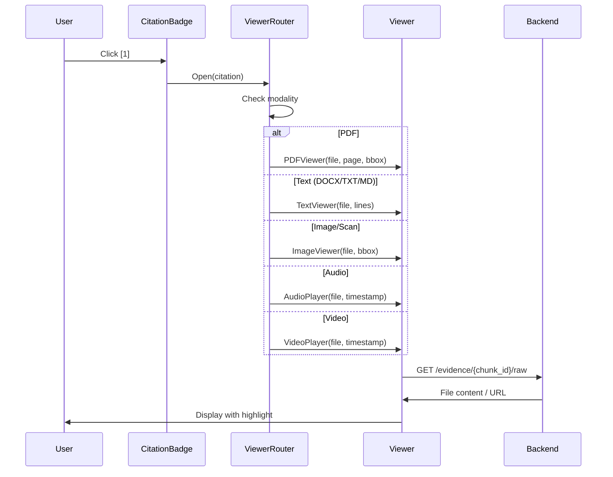

# Universal Evidence Citer - Design Document

## Core Concept

Every answer is backed by **traceable evidence**. Each citation points to an exact location in any source type.

---

## Citation Structure

```typescript
interface Citation {
  // Identity
  chunk_id: string;           // Unique evidence ID
  source_id: string;          // File identifier
  source_file: string;        // Original filename
  
  // Modality
  modality: "pdf" | "docx" | "txt" | "markdown" | "image" | "scan" | "audio" | "video";
  
  // Location (varies by modality)
  location: {
    // For documents (PDF, DOCX, TXT, MD)
    page?: number;            // Page number (PDF)
    section?: string;         // Section/heading (DOCX)
    line_start?: number;      // Start line (TXT, MD)
    line_end?: number;        // End line (TXT, MD)
    
    // For visual (Image, Scan, Video frame)
    bbox?: [number, number, number, number];  // [x1, y1, x2, y2] normalized 0-1
    
    // For temporal (Audio, Video)
    timestamp_start?: number; // Seconds
    timestamp_end?: number;   // Seconds
  };
  
  // Evidence
  text_snippet: string;       // Extracted text (max 200 chars)
  confidence: number;         // 0.0 - 1.0
  
  // Conflicts
  conflicts_with: string[];   // IDs of contradicting evidence
}
```

---

## Viewer Routing

```
┌─────────────────────────────────────────────────────────────────┐
│                    USER CLICKS CITATION                         │
└─────────────────────────────────────────────────────────────────┘
                              │
                              ▼
                    ┌─────────────────┐
                    │ Check Modality  │
                    └─────────────────┘
                              │
        ┌─────────┬───────────┼───────────┬───────────┐
        ▼         ▼           ▼           ▼           ▼
   ┌─────────┐ ┌─────────┐ ┌─────────┐ ┌─────────┐ ┌─────────┐
   │   PDF   │ │  TEXT   │ │  IMAGE  │ │  AUDIO  │ │  VIDEO  │
   │ PDF.js  │ │  HTML   │ │   IMG   │ │ <audio> │ │ <video> │
   │ + page  │ │ + line  │ │ + bbox  │ │ + time  │ │ + time  │
   │ + rect  │ │ + scroll│ │ overlay │ │ jump    │ │ jump    │
   └─────────┘ └─────────┘ └─────────┘ └─────────┘ └─────────┘
```

---

## Viewer Components

### 1. PDF Viewer
```tsx
// Uses PDF.js
<PDFViewer 
  file={source_file}
  page={location.page}
  highlight={location.bbox}  // Rectangle to highlight
/>
```
- Open specific page
- Draw highlight rectangle
- Scroll to highlighted area

### 2. Text Viewer (DOCX, TXT, Markdown)
```tsx
// Simple HTML with line highlighting
<TextViewer
  file={source_file}
  lineStart={location.line_start}
  lineEnd={location.line_end}
  section={location.section}
/>
```
- Convert DOCX → HTML (Mammoth.js or backend)
- Highlight line range with CSS
- Scroll to section

### 3. Image Viewer (Images, Scans)
```tsx
//  with canvas overlay
<ImageViewer
  file={source_file}
  bbox={location.bbox}
  ocrText={text_snippet}  // For scans
/>
```
- Display image
- Draw bounding box overlay
- Show OCR text tooltip

### 4. Audio Player
```tsx
// Native <audio> with timestamp jump
<AudioPlayer
  file={source_file}
  startTime={location.timestamp_start}
  endTime={location.timestamp_end}
  transcript={text_snippet}
/>
```
- Jump to timestamp on load
- Highlight transcript segment
- Show waveform (optional)

### 5. Video Player
```tsx
// Native <video> with timestamp jump
<VideoPlayer
  file={source_file}
  startTime={location.timestamp_start}
  endTime={location.timestamp_end}
  transcript={text_snippet}
/>
```
- Jump to timestamp on load
- Show frame with optional bbox overlay
- Display transcript

---

## LanceDB Schema (Updated)

```python
class EvidenceChunk(LanceModel):
    # Identity
    chunk_id: str
    source_id: str
    source_file: str
    
    # Modality
    source_type: str      # pdf, docx, txt, markdown, image, scan, audio, video
    modality: str         # text, image, audio_transcript, video_frame, ocr
    
    # Content
    text_content: str | None
    image_path: str | None
    
    # Embeddings
    text_embedding: Vector(384) | None
    image_embedding: Vector(512) | None
    
    # Location (unified)
    page_number: int | None           # PDF
    section: str | None               # DOCX heading
    line_start: int | None            # TXT, MD
    line_end: int | None              # TXT, MD
    timestamp_start: float | None     # Audio, Video (seconds)
    timestamp_end: float | None       # Audio, Video (seconds)
    bbox: list[float] | None          # [x1, y1, x2, y2] normalized
    
    # Metadata
    confidence: float = 1.0
    created_at: str
```

---

## API Response Format

```json
{
  "answer": "The revenue grew by 23% in Q3...",
  "confidence": 0.87,
  "refused": false,
  "citations": [
    {
      "chunk_id": "pdf_001_p12_c3",
      "source_id": "doc_abc123",
      "source_file": "quarterly_report.pdf",
      "modality": "pdf",
      "location": {
        "page": 12,
        "bbox": [0.1, 0.3, 0.9, 0.4]
      },
      "text_snippet": "Revenue increased 23% year-over-year...",
      "confidence": 0.92,
      "conflicts_with": []
    },
    {
      "chunk_id": "vid_002_t145",
      "source_id": "vid_xyz789",
      "source_file": "cfo_interview.mp4",
      "modality": "video",
      "location": {
        "timestamp_start": 145.5,
        "timestamp_end": 152.3
      },
      "text_snippet": "We're optimistic but watching costs carefully...",
      "confidence": 0.78,
      "conflicts_with": ["pdf_001_p12_c3"]
    }
  ],
  "conflicts": [
    {
      "claim": "Revenue outlook",
      "sources": ["pdf_001_p12_c3", "vid_002_t145"],
      "type": "contradiction",
      "confidence": 0.85
    }
  ]
}
```

---

## Frontend Component Structure

```
src/components/
├── Citation/
│   ├── CitationBadge.tsx      # Clickable [1] badge
│   ├── CitationCard.tsx       # Expanded citation info
│   └── CitationList.tsx       # List of all citations
├── Viewer/
│   ├── ViewerModal.tsx        # Modal wrapper
│   ├── ViewerRouter.tsx       # Routes to correct viewer
│   ├── PDFViewer.tsx          # PDF.js
│   ├── TextViewer.tsx         # HTML text with highlights
│   ├── ImageViewer.tsx        #  + canvas overlay
│   ├── AudioPlayer.tsx        # <audio> + transcript
│   └── VideoPlayer.tsx        # <video> + transcript
└── Conflict/
    └── ConflictGraph.tsx      # D3 visualization
```

---

## Click-to-Source Flow



---

## Implementation Simplicity

### What we DON'T need:
- ❌ Separate DOCX viewer library
- ❌ Complex video player library
- ❌ Audio waveform visualization
- ❌ PDF annotation library

### What we USE:
- ✅ PDF.js (only for PDFs)
- ✅ Native `` + CSS/Canvas overlay
- ✅ Native `<audio>` with `currentTime`
- ✅ Native `<video>` with `currentTime`
- ✅ Simple HTML for text (convert DOCX on backend)
